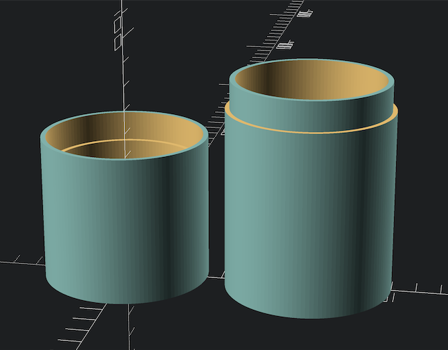

# Cup with Lid

This is a simple cup with a friction-fit lid.  The defaults:

```
// make smooth circles
fn=128;

// wall thickness ~4mm, including the base and top of the lid
thickness = 4;

// the size of the inside diameter
inner_diameter = 60;

// height of the cup and the lid
cup_height = 79 + thickness;
cap_height = 52 + thickness;

// create an air hole in the lid?
air_lid = true;

// create an air hole in the cup?
air_cup = true;

// air hole diameter?
air_hole_size = 2;
```



