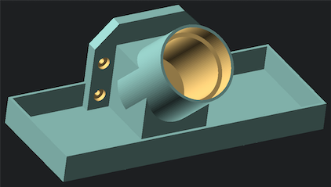

# DeWalt DCD991 Wall Holder with Parts Bin

This is a wall holder for a DeWalt DCD991 drill.  It has many options for the wings on the sides, and a parts bin to hold drill bits, screws, etc..  


The defaults:
```
// adjust this section to fit your drill (if not DeWalt DCD991)
big_ring_diameter = 50;
big_ring_height = 14;
small_ring_diameter = 44;
small_ring_height = 53;
wall_thickness = 4;
base_thickness=2;


// wings are for the screws into the wall.
wing_width = big_ring_diameter;
wing_depth = wall_thickness * 2;
wing_height = wing_width / 3;

// show the top wing?
wing_top = true;
// wing_xx_screws can be TOP|BOTTOM|BOTH
wing_top_screws = NONE;

// show the left wing?
wing_left = true;
// wing_xx_screws can be TOP|BOTTOM|BOTH
wing_left_screws = BOTH;

// show the right wing?
wing_right = true;
// wing_xx_screws can be TOP|BOTTOM|BOTH
wing_right_screws = BOTH;

// show the bottom wing?
wing_bottom = true;
// wing_xx_screws can be TOP|BOTTOM|BOTH
wing_bottom_screws = BOTH;


// parts_side can be NONE|LEFT|RIGHT|FULL|BOTH
// BOTH = one on the left, one on the right
// FULL = expands to the run across the front
parts_side = FULL;

parts_holder_width = 75;
parts_holder_height = 20;
parts_holder_thickness = 2;
parts_holder_depth = big_ring_diameter - parts_holder_thickness;

// add up the heights
total_height = big_ring_height + small_ring_height;

// These screw dimenions fit standard pocket hole screws
// Diameter of the screw you plan to use
screw_diam=4;

// Diameter of screw-head
screw_head=9;

// Screw-head height (deepness for screw-head hole)
screw_head_h=3;

// The depth of the platform that holds the hot sauce
stand_width = 50;

// The thickness of this stand
stand_thickness = 3;

// The number of facets used to generate an arc (higher is smoother, but takes more time to render)
fn=128;
```

### Print Settings
| Printer | Qidi X-Plus |
| ------- | ----------- |
| Material | PLA |
| Supports | Yes |
| Raft | No |
| Skirt | Yes |
| Glue | Yes |
| Config | Fine |
| Printing Temp | 190° |
| Print Init Layer | 190° |
| Build Plate Temp | 50° |
| Build Plate Init Layer | 60° |
| Print ETA | 23h 24min |
| Material Cost | 202g |


