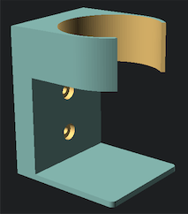

# Hot Sauce Holder

This is a small bracket that will hold a standard bottle of hot sauce.


The defaults:
```
// The width of the entire bracket
bracket_width = 55;

// The thickness of the back part of the bracket
bracket_thickness = 13;

// The diameter of the circle where the hot sauce sits
holder_diameter = 55;

// The overall height of the bracket
stand_height = 55;

// How tall (thick) the arms are that hold the bottle
holder_thickness = 25;

// The gap in the front of the holder
holder_gap_width = holder_diameter * 0.6;

// The thickenss of the arms that hold the hotsauce
holder_arm_thickness=4;

// These screw dimenions fit standard pocket hole screws
// Diameter of the screw you plan to use
screw_diam = 4;

// Diameter of screw-head
screw_head = 9;

// Screw-head height (deepness for screw-head hole)
screw_head_h = 3;

// The depth of the platform that holds the hot sauce
stand_width = 50;

// The thickness of this stand
stand_thickness = 3;

// The number of facets used to generate an arc (higher is smoother, but takes more time to render)
fn=128;
```



