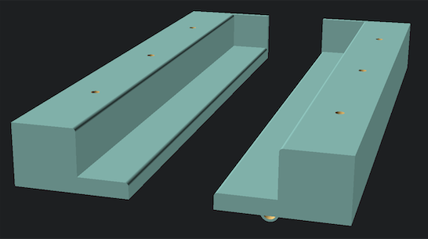

# Mac Under Desk Bracket

This is a two piece bracket to be installed under a desk.  There is the option to put in a back stop, or not.  If you would like a "longer" bracket, print two and adjust the length.  One with the stop, one without.  There is an option for a cable clip.  I put in a clip that fit my USB cable, but you can adjust that size too.  


The defaults:
```
/ the overall length of the bracket
// macbook pro is approximately 340mm
// you can print two pieces, one without the end_stop, and place them end to end.
bracket_length = 250;

// the overall width of each bracket arm
bracket_width = 50;

// the thickness of the lip that holds the laptop
lip_height = 7;

// The macbook pro requires approximately 20.5mm to comfortably slide in and out
bracket_height = 20.5 + lip_height;

// the width of the part that holds the laptop
lip_width = 25;

// put a stop on the end?
end_stop = true;

// how thick to make the end stop?
end_stop_thickness = 3;

// for the cable clip, how thick is your cable? Standard Apple usb-c cable is ~4mm
cable_diameter = 5.5;

// how thick is the clip?
cable_clip_thickness = 2;

// how wide is the clip?
cable_clip_width = 6;

// These screw dimenions fit standard pocket hole screws
// Diameter of the screw you plan to use
screw_diam=4;

// Diameter of screw-head
screw_head=9;

// Screw-head height (deepness for screw-head hole)
screw_head_h=3;

// The width of the stand
stand_width = 50;

// The thickness of this stand
stand_thickness = 3;

// The number of facets used to generate an arc (higher is smoother, but takes more time to render)
fn=128;
```


